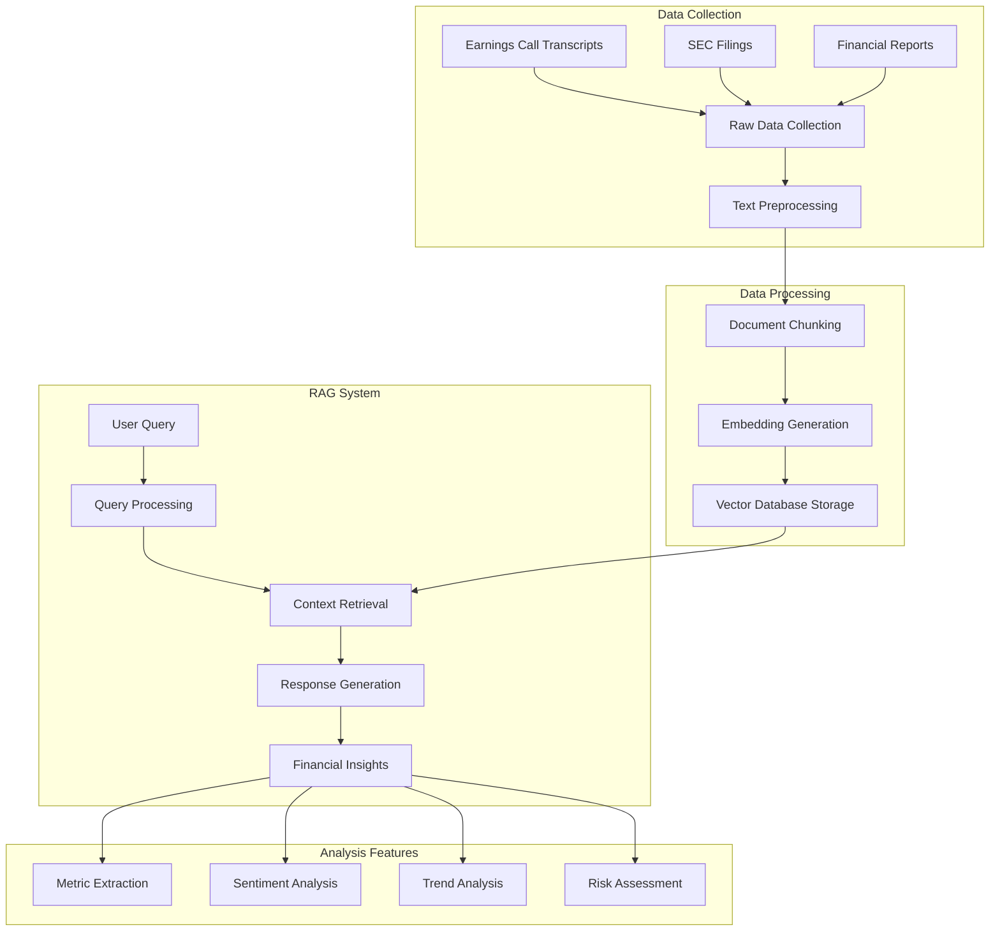

# financial-insight-rag
# QuarterlyQuant: AI-Powered Financial Analysis Platform 📊


QuarterlyQuant is an advanced financial analysis platform that leverages Retrieval-Augmented Generation (RAG) to transform earnings calls, SEC filings, and financial reports into actionable insights. Built for analysts, investors, and financial professionals, it automates the extraction and analysis of critical financial information.

## 🌟 Key Features

- **Automated Earnings Analysis**: Process earnings call transcripts in real-time
- **Intelligent Metric Extraction**: Automatically identify and track key financial metrics
- **Comparative Analytics**: Quarter-over-quarter and peer comparison capabilities
- **Sentiment Analysis**: Analyze management tone and confidence levels
- **Custom Visualization**: Interactive dashboards for financial metrics

## 🔄 QuarterlyQuant Pipeline



## 💻 Technical Architecture

### 1. Data Collection Layer
- Earnings Call Transcripts (APIs/Web Scraping)
- SEC Filings (EDGAR Database)
- Financial Reports (Company Websites)

### 2. Processing Layer
- Text Preprocessing & Cleaning
- Document Chunking & Segmentation
- Embedding Generation (Sentence Transformers)
- Vector Storage (Qdrant)

### 3. Analysis Layer
- RAG-based Information Retrieval
- Financial Metric Extraction
- Sentiment Analysis
- Trend Detection

## 🚀 Quick Start

```bash
# Clone the repository
git clone https://github.com/yourusername/quarterly-quant.git

# Navigate to project directory
cd quarterly-quant

# Install dependencies
pip install -r requirements.txt

# Set up environment variables
cp .env.example .env

# Run the application
uvicorn src.main:app --reload
```

## 📊 Usage Examples

### 1. Basic Analysis
```python
from quarterly_quant import Analyzer

# Initialize analyzer
analyzer = Analyzer()

# Analyze earnings call
results = analyzer.analyze_earnings("AAPL", "Q3_2023")

# Get specific insights
metrics = results.get_key_metrics()
sentiment = results.get_sentiment_analysis()
trends = results.get_trend_analysis()
```

### 2. API Endpoints
```python
# REST API Example
POST /api/v1/analyze
{
    "company": "AAPL",
    "quarter": "Q3_2023",
    "analysis_type": "full"
}
```

### 3. Sample Output
```json
{
    "metrics": {
        "revenue_growth": "+12.5%",
        "profit_margin": "28.3%",
        "yoy_growth": "+15.2%"
    },
    "sentiment": {
        "overall": "positive",
        "confidence": 0.85,
        "key_themes": [
            "AI Innovation",
            "Market Expansion",
            "Supply Chain Optimization"
        ]
    },
    "risks": {
        "identified_risks": [
            "Market Competition",
            "Regulatory Changes"
        ],
        "risk_level": "moderate"
    }
}
```

## 📁 Project Structure

```
quarterly_quant/
├── src/
│   ├── core/          # Core analysis logic
│   │   ├── analyzer.py
│   │   └── processor.py
│   ├── data/          # Data collection
│   │   ├── collector.py
│   │   └── preprocessor.py
│   ├── models/        # ML models
│   │   ├── embeddings.py
│   │   └── rag_model.py
│   └── api/           # API endpoints
│       ├── routes.py
│       └── schemas.py
├── tests/             # Test cases
├── docs/              # Documentation
└── notebooks/         # Examples
```

## 🛠️ Technologies Used

- **Backend Framework**: FastAPI
- **Database**: Qdrant (Vector DB)
- **ML/AI**: 
  - PyTorch
  - Sentence Transformers
  - Hugging Face Transformers
- **Data Processing**:
  - Pandas
  - NumPy
  - Beautiful Soup
- **Visualization**:
  - Plotly
  - Streamlit

## 📈 Features & Capabilities

1. **Financial Analysis**
   - Revenue & Growth Metrics
   - Profit Margins
   - Cash Flow Analysis
   - YoY Comparisons

2. **Text Analysis**
   - Management Tone Analysis
   - Risk Factor Identification
   - Strategic Initiative Tracking
   - Competition Analysis

3. **Visualization**
   - Interactive Dashboards
   - Trend Charts
   - Comparative Analysis
   - Custom Reports

## 🔍 Use Cases

1. **Investment Research**
   - Earnings Call Analysis
   - Company Performance Tracking
   - Risk Assessment

2. **Financial Analysis**
   - Metric Extraction
   - Trend Analysis
   - Peer Comparison

3. **Strategic Planning**
   - Market Intelligence
   - Competitive Analysis
   - Industry Trends

## 🚀 Future Roadmap

- [ ] Real-time earnings call analysis
- [ ] Advanced competitor analysis
- [ ] Custom metric tracking
- [ ] Industry-specific insights
- [ ] Integration with trading platforms

## 🤝 Contributing

1. Fork the repository
2. Create your feature branch (`git checkout -b feature/AmazingFeature`)
3. Commit your changes (`git commit -m 'Add some AmazingFeature'`)
4. Push to the branch (`git push origin feature/AmazingFeature`)
5. Open a Pull Request

## 📝 License

This project is licensed under the MIT License - see the [LICENSE](LICENSE) file for details.


## 📧 Contact

Email : kancharlakoushik8547@gmail.com
Linkedin : https://www.linkedin.com/in/kancharla-koushik-773bbb16a/ 

